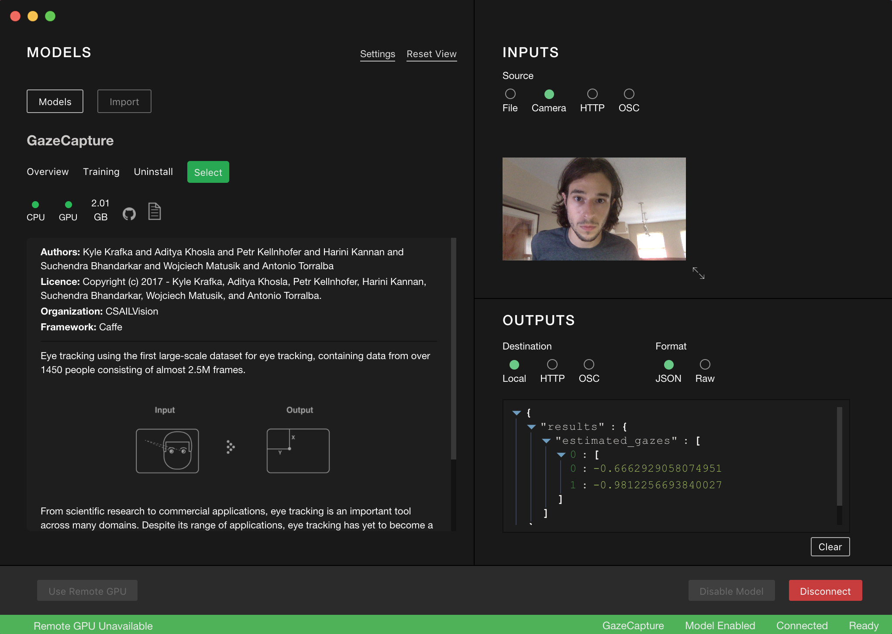

I recently attended ITP Camp 2018, a 4 week crash course/playground that I've heard described as "a center for the recently possible," hosted at NYU's Interactive Telecommunications Program. It was a wonderful opportunity to make stuff, learn from people working on the cutting edge of art and engineering, and collaborate with people from diverse disciplines.

One of the best sessions I went to was about how artists and coders can use machine learning for their creative work. The session was led by the creator of [RunwayML](https://runwayml.com/), a beautiful and accessible open-source machine learning desktop application. RunwayML deals with all of the setup headaches that tend to come with machine learning. It bundles a bunch of pre-trained models (im2txt, OpenPose, YOLO, and GazeCapture), handles the setup automatically with Docker, and lets you select inputs and outputs through the GUI. It's currently in private beta, so you'll need an invite to download the app, but hopefully it will be available soon.

I got up and running with the GazeCapture model, with the intention of having an animated set of eyes in a browser window follow the actual gaze of your eyes. Here's the result:

<tweet tweetid="1010625334197342208"></tweet>

It's not perfect, but that's because either my computer's GPU isn't fast enough, or the model was actually running on my CPU instead (not sure which). If I were to use gaze tracking in an installation, it would definitely be good to use a computer with a fast GPU or outsource the computation to a remote GPU with something like Paperspace. Runway actually has a setting to automatically set up a remote GPU, but it isn't enabled yet.

Here's the Runway user interface:

[[full]]
| 

You can select a bunch of inputs to feed into the model (files, webcam, HTTP, or Open Sound Control), and you can download the output locally as a file, send it over a local HTTP server or over OSC. I chose the local HTTP server, a Node.js based server with Websockets (using socket.io) enabled, which is really handy.

I found a good design for a set of eyes that follow the user's mouse [on Codepen](https://codepen.io/andykennan/pen/zWvQJX), and adapted them to follow the coordinate set that's streamed over a local Websocket connection from Runway.

Here's my code. The HTML and CSS from the Codepen are mostly unchanged (although you need to include the socket.io client script).

```javascript
// This array will get updated with all the gazes detected in the image
let detectedGazes = []

// Create a connection with Runway
// *You should update this address to match the URL provided by the app
const socket = io.connect('http://172.30.27.247:3333/')

let drawing = false

// utility functions for constraining and mapping the RunwayML output to the viewport
function constrain(amt, low, high) {
  return amt < low ? low : amt > high ? high : amt
}

function map(value, istart, istop, ostart, ostop) {
  return ostart + (ostop - ostart) * ((value - istart) / (istop - istart))
}

document.addEventListener('DOMContentLoaded', function() {
  // Wait until the page is loaded
  // When a connection is established

  // When there is a data event, update the gaze array
  socket.on('data', function(data) {
    if (data.results.estimated_gazes.length > 0) {
      detectedGazes = data.results.estimated_gazes
      console.log(detectedGazes)
    }
    if (!drawing) {
      drawGaze()
      drawing = true
    }
  })
})

function drawGaze() {
  const eyelids = document.querySelectorAll(
      '.eyes-wrapper__inner__eye__eyelid'
    ),
    iris = document.querySelectorAll('.eyes-wrapper__inner__eye__iris'),
    eyesWrapper = document.querySelector('.eyes-wrapper')

  function calcSkew(max, windowWidth, x, y, skewY) {
    // setup
    const halfWidth = windowWidth / 2 // get the half width of the window
    const halfCurrentPos = x - halfWidth // get position of x/y releative to halfWidth
    const percentageDecimal = halfCurrentPos / halfWidth // turn halfCurrentPos into a percentage decimal
    let skewDegree

    if (y < window.innerHeight / 2) return 0

    if (!skewY) {
      // calculations for posX
      if (halfCurrentPos > 0) {
        skewDegree = -Math.abs(Math.floor(percentageDecimal * max)) // flip skewDegree to negetive for pos on right side
      } else {
        skewDegree = Math.abs(Math.floor(percentageDecimal * max)) // calc skewDegree for left side
      }
    } else {
      // calculations for posY
      if (halfCurrentPos > 0) {
        skewDegree = Math.abs(Math.floor(percentageDecimal * max)) // calc skewDegree for right side
      } else {
        skewDegree = -Math.abs(Math.floor(percentageDecimal * max)) // flip skewDegree to negetive for pos on left side
      }
    }
    return skewDegree
  }

  function drawPos() {
    // config
    // console.log(detectedGazes);
    const positions = detectedGazes[0]
    const windowWidth = window.innerWidth,
      windowHeight = window.innerHeight,
      x = Math.floor(
        constrain(map(positions[0], -10, 10, 0, windowWidth), 0, windowWidth)
      ),
      y = Math.floor(
        constrain(
          map(positions[1], -2.5, -20, 0, windowHeight),
          0,
          windowHeight
        )
      ),
      posLeftPercetange = (x / windowWidth) * 100, // turn x pos into a percentage
      posTopPercentage = (y / windowHeight) * 100 // turn y pos into a percentage

    for (var i = 0; i < iris.length; i++) {
      iris[i].style.left = posLeftPercetange + '%'
      iris[i].style.transform =
        'translate(-50%, -50%) skewX(' +
        calcSkew(12, windowWidth, x, y) +
        'deg) skewY(' +
        calcSkew(12, windowHeight, x, y, 'skewY') +
        'deg)'
    }

    for (var j = 0; j < iris.length; j++) {
      iris[j].style.top = posTopPercentage + '%'
      iris[j].style.transform =
        'translate(-50%, -50%) skewX(' +
        calcSkew(12, windowWidth, x, y) +
        'deg)  skewY(' +
        calcSkew(8, windowWidth, x, y, 'skewY') +
        'deg)'
    }
    requestAnimationFrame(drawPos)
  }
  drawPos()
}
```
