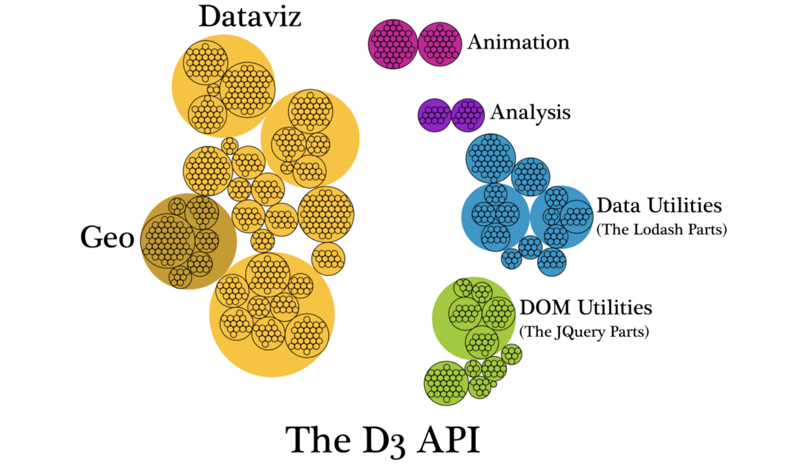

There are a bunch of ways to make charts in javascript. You could use a high-level library like Highcharts or Chart.js (and too many others to count). You could do [everything yourself in vanilla javascript](https://medium.com/@PepsRyuu/why-i-no-longer-use-d3-js-b8288f306c9a).

For most developers, those are two extremes on opposite ends of a spectrum. Both have the potential to be reusable, but each extreme has its downsides.

If you use a high-level library and need any kind flexibility, or need a chart that isn't supported by the library you choose, you're going to be shit outta luck.

On the other hand, if you write your charts in vanilla javascript, you'll have all of the flexibility, but you're going to be stuck writing code for things which are, for the most part, already solved problems—like creating scales, axes, map projections, and binding data to DOM elements.

That's why most developers who make data visualizations for the web have settled on D3. It doesn't give you any charts out of the box, but it does give you utilities for many of the hardest parts of data visualization:

[[full]]
| 

<small style="font-style: italic">Source: [Elijah Meeks](https://medium.com/@Elijah_Meeks/d3-is-not-a-data-visualization-library-67ba549e8520)</small>

The API is huge. And some of D3's concepts can be tricky to learn (I'm looking at you, enter-update-exit). If we just look at the pure "dataviz" parts, here's what we have:

[[full]]
| 

<small style="font-style: italic">Source: [Elijah Meeks](https://medium.com/@Elijah_Meeks/d3-is-not-a-data-visualization-library-67ba549e8520)</small>

None of these will actually give you a chart! You'll still have to write a lot of code on your own.

Luckily, the D3 community is replete with examples. There's [bl.ocks](https://bl.ocks.org/) and [Observable](https://beta.observablehq.com/), each with thousands of chart examples. There's the [[d3.js]](https://stackoverflow.com/questions/tagged/d3.js) tag on Stack Overflow. Copying and pasting has never been easier.

But these examples usually stop short once the chart is on the screen. What if you want to reuse that chart over and over again? What if you want to abstract out basic chart functionality like responsiveness and tooltip positioning? Should you keep copying and pasting your old D3 code? That'll work for a while, but what happens when you're on a team of developers? Should everyone copy and paste example code from bl.ocks for every data visualization they need to make?

Of course not.

So, we need to refactor our code to make it more D.R.Y. and reusable. Here are some helpful patterns I've found to do just that.

## Closures

The closure pattern is probably the most well-known technique for encapsulating reusable charts, [popularized by Mike Bostock](https://bost.ocks.org/mike/chart/) way back in 2012 (don't worry, it's still relevant).

Let's make a bar chart with Mike's closure pattern:

```js
import * as d3 from 'd3'

function barChart() {
  // default values for the chart's configuration
  let width = 600
  let height = 400

  function chart(selection) {
    // chart logic will go here
  }

  // getter and setter methods to change chart config
  chart.width = function(value) {
    if (!arguments.length) return value
    width = value
    return chart
  }

  chart.height = function(value) {
    if (!arguments.length) return value
    height = value
    return chart
  }

  return chart
}

export default barChart
```

You could then call the chart like this:

```js
const myBarChart = barChart()
  .width(800)
  .height(600)

d3.select('#viz').call(myBarChart)
```

In this example, `width` and `height` are variables inside of the `barChart` function's lexical scope. They aren't available outside of that function, but we've exposed two getter/setter functions on the interior `chart` function (in javascript, functions are both functions and objects).

Since the `chart` function is returned whenever `barChart` is called, you can adjust width and height by calling `barChart().width()` and `barChart.height()`. You can chain these together, because each setter method will change its respective variable inside of the closure, and return the `chart` function back out.

The surface area of the API will depend on your team's needs. Let's build the example out a bit further, and include more getter/setter methods on the chart.

```js
import * as d3 from 'd3'

function barChart() {
  // default values for the chart's configuration
  let width = 600
  let height = 400
  let x = d => d.x
  let y = d => d.y
  let color = '#ae90eb'

  function chart(selection) {
    selection.each(d, this)
  }

  // getter and setter methods to change chart config
  chart.width = function(value) {
    if (!arguments.length) return value
    width = value
    return chart
  }

  chart.height = function(value) {
    if (!arguments.length) return value
    height = value
    return chart
  }

  return chart
}

export default barChart
```

## Classes

## React

React is eating the web. Love it or hate it, there's no denying its ever increasing popularity. You 100% don't need React to make a nice visualization. In most cases, unless you have an entire dashboard of charts that need to respond to changes in state, I probably wouldn't recommend it. The added cost of the framework—in terms of bundle size and the time it takes to learn React for you as a developer—just isn't worth it.

With that said, _I really fucking love making data visualizations in React_. It just feels comfortable. And anyway, at the place where I work, React is scoped globally on our main website, so I basically get to use it for free when I create data visualizations. It's lovely.

- Use React to scaffold your component, but hand off control of the DOM to D3 in `componentDidMount()`
- Let React take care of the DOM, and let D3 handle the math

_Note: for more advanced examples of reusability with D3, I would recommend checking out some of the libraries linked in the awesome-d3 repo, and reading their code to see how they implement things._
